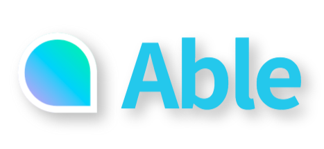
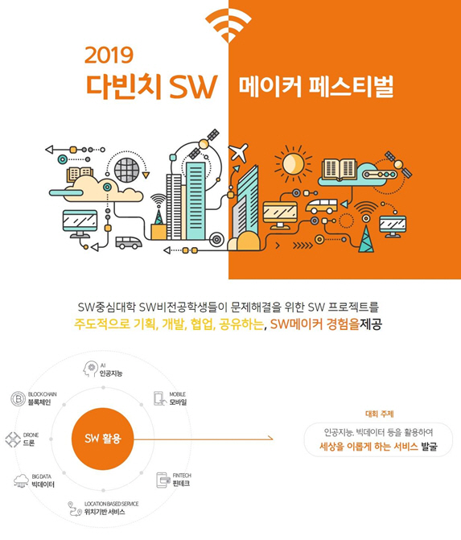
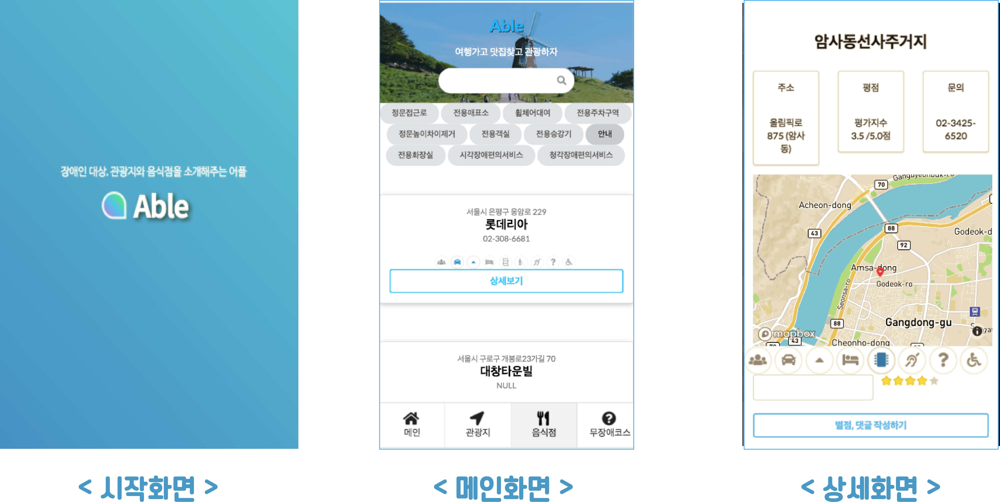

#  장애인 편의시설 소개 어플

## 0. 대회
### 1) 기간
- 2019년 11월 15일 ~ 2019년 11월 16일

### 2) 대회 포스터

### 3) 수상
- 우수상(전체 팀 중 3등 수상)

## 1. 아이디어
### 1) 아이디어 요약
장애인 대상, 관광지, 음식점, 편의시설 여부 소개 어플

### 2) 개발 동기
2017년 기준 서울시의 장애인 인구수는 약 39만명이며 해당 인구 대비 장애인 편의시설은 약 97%에 이른다(서울 기준). 하지만 서울을 제외한 지역에서는 아직 편의시설이 부족하다. 서울시의 경우 편의시설의 수가 많지만 실제 시설의 위치와 상태를 뚜렷히 볼 방법이 적다. 구글이 발표한 '아태 지역 모바일 앱 보고서 2016'에 따르면, 한국 시장에서 스마트폰 사용률이 91%이다. 즉, 거의 모든 사람들이 스마트폰을 사용한다는 말이다.
이점을 참고하여 접근성이 높은 어플리케이션 형태로, 장애인들이 쉽게 편의시설 위치를 확인할 수 있게 하며 해당 시설에 대한 노후와 불만 사항을 실사간으로 피드백할 수 있게 만든다.

### 3) 개발의 필요성
장애인들은 보호자를 동반하지 않으면 여행, 축제, 행사 등을 쉽게 갈 수 없다. 여러 사이트를 통해 장애인들의 이용이 편리한 음식점, 숙박업소, 관광지 등을 찾는 것은 장애인과 보호자에게 다소 복잡하고 어렵다. 따라서 장애인들과 보호자들이 보다 편리하게 서비스를 이용할 수 있도록 편의시설 정보를 제공하며 더불어 장애인 참여 프로그램 정보를 모아 해당 정보에 대한 접근성을 높이고자 한다.

### 4) 기능
- 관광지, 음식점, 숙박업소에 있는 편의시설의 유뮤 알림

- 사용자의 이용 후기, 좋아요 기능

- 지역별 장애인 복지 프로그램, 취업 등 행사 알림 서비스

## 2. 개발
### 1) 사용 기술
- python & R을 이용한 데이터 분석

- 공공 데이터 오픈 API 사용

### 2) 역할
- frontend(KumJungMin.)

- backend (SE0T00L.)

- CTO (LeeJiWon.)

### 3) 화면 구성

### 4) 시연 영상
 https://www.youtube.com/watch?v=6Q_bDHCN20o
